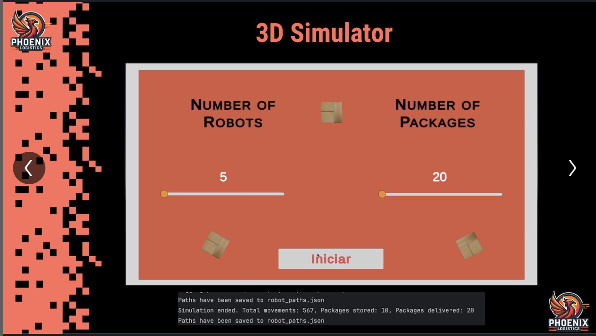
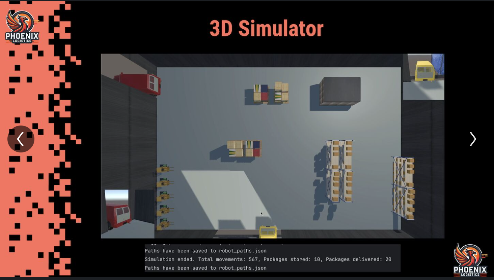
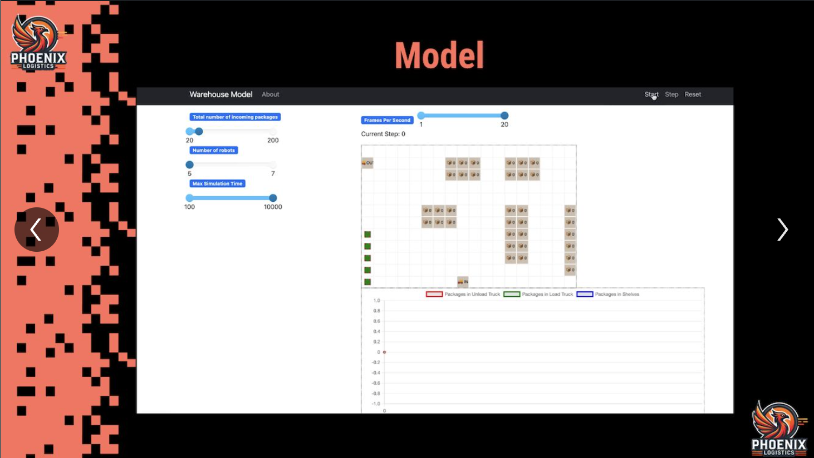
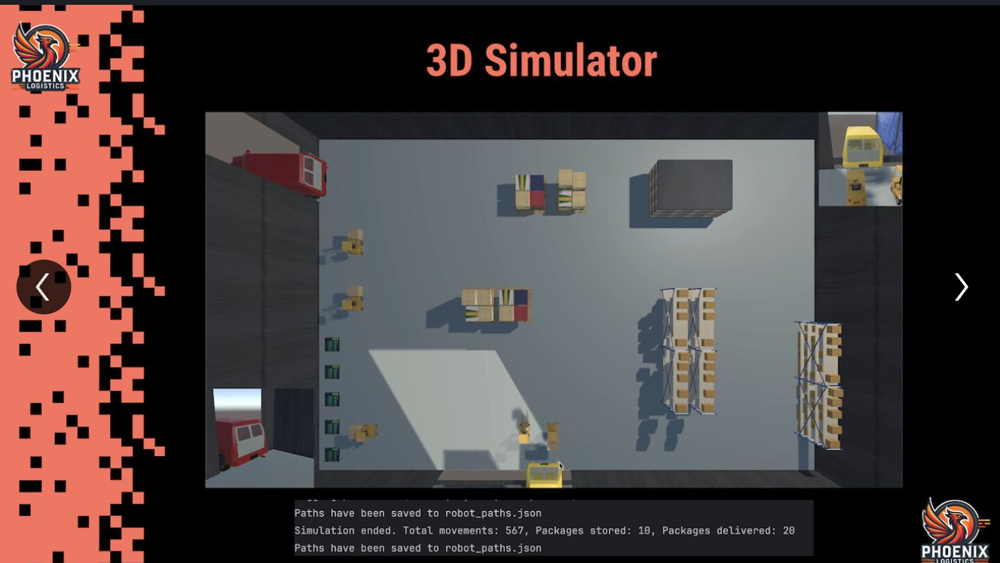
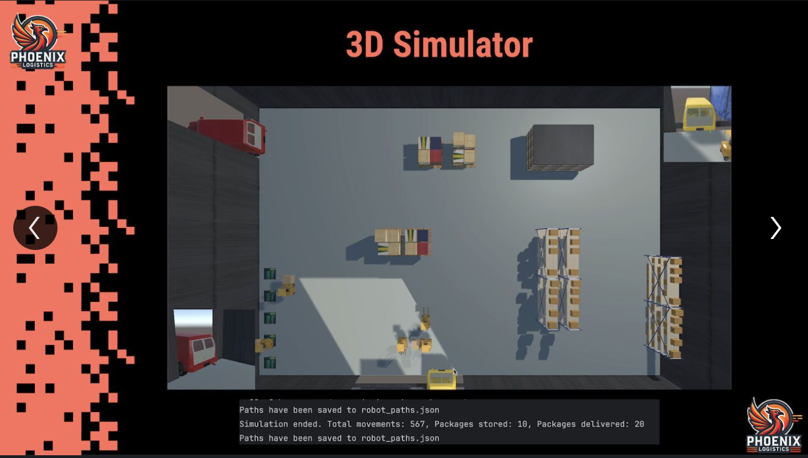
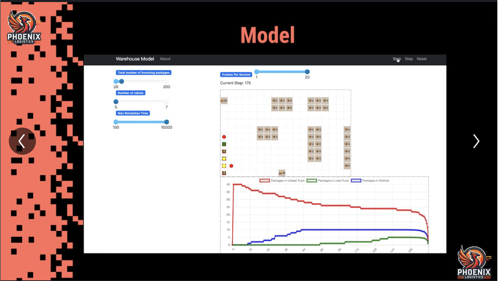
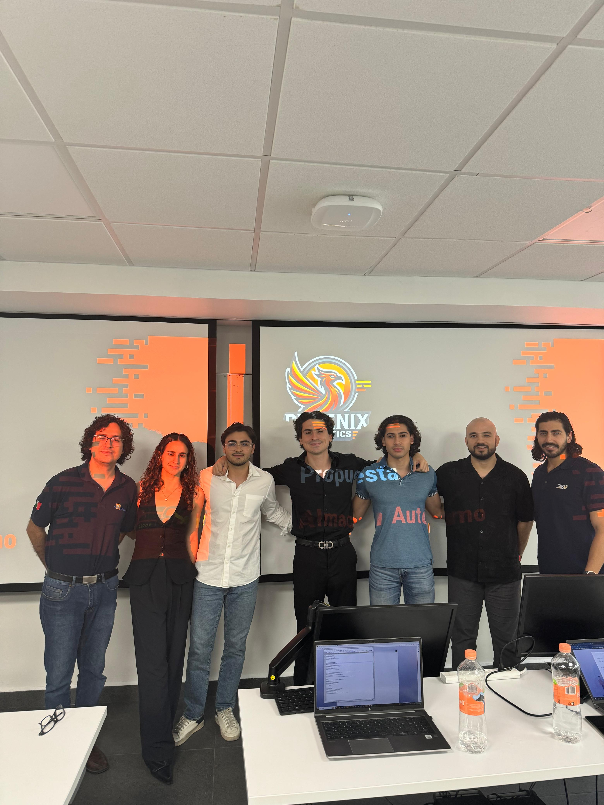

# Phoenix - E80 Autonomous Warehouse Solution

## Overview
Phoenix is a 3D warehouse automation solution developed for E80 Group, designed to streamline LGV (Laser-Guided Vehicle) operations, including unloading, storage, and truck reloading. By leveraging Unity and C# for real-time simulations, along with Python and FastAPI for backend workflows, Phoenix reduces human intervention and optimizes warehouse efficiency through advanced pathfinding and automation.

## Purpose
Phoenix revolutionizes warehouse management by automating LGV operations to improve operational efficiency and ensure seamless workflows. With advanced features like collision-free pathfinding using the A* Search Algorithm, real-time monitoring, and behavior modeling, it minimizes errors and enhances productivity while allowing customizable simulations for various scenarios.

## Key Features
* Automated LGV Operations: Autonomous handling of unloading, storage, and truck reloading.
* Collision-Free Pathfinding: A* Search Algorithm ensures efficient, optimized navigation in dynamic environments.
* Real-Time 3D Simulation: Unity-powered visualization for dynamic warehouse operations and task execution.
* Behavior Modeling: Mesa library simulates LGV interactions for realistic workflows.
* Customizable Scenarios: Flexible configurations for testing warehouse layouts and operations.
* Seamless Integration: FastAPI facilitates smooth communication between backend systems and LGV models.
## Technology Stack
### Backend
* Python: Core logic and workflow management.
* FastAPI: Communication between components for real-time operations.
### Simulation
* Unity (C#): 3D modeling and visualization of LGV tasks.
* Mesa Library: LGV behavior modeling and interaction simulations.
### Algorithm
* A Search Algorithm*: Efficient and collision-free pathfinding for autonomous LGVs.

## Phoenix Demo

### Home

  

### Unity/Mesa 1st Simulation Frame
  

### Unity/Mesa 2nd Simulation Frame
  

### Unity/Mesa 3rd Simulation Frame
  

## Team

  

